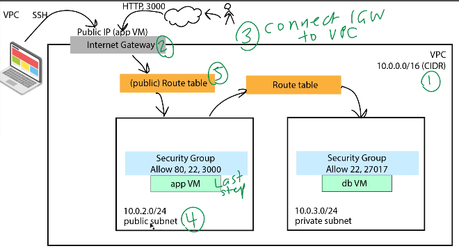
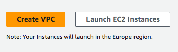
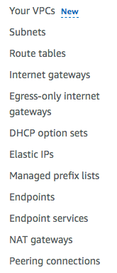
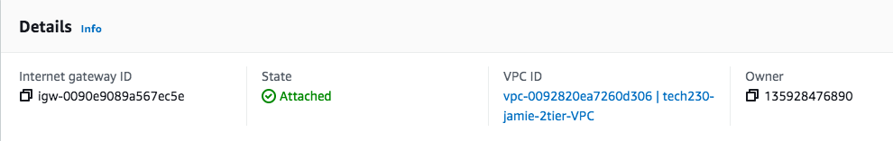
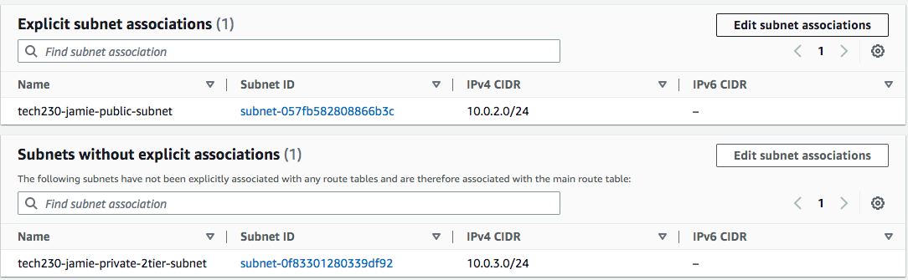
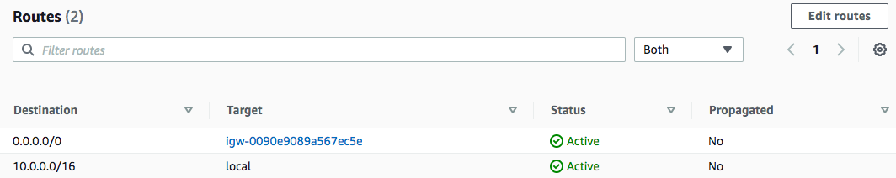

# Setting up two tier VPC

- We first must search for vpc in the search bar, and then select create VPC.

- In here we give our VPC an appropriate name.
- We set the IPv4 CIDR as "10.0.0.0/16"
- To set up everything else we need. we navigate to the side bar.

## Internet gateway
- Here, we next select `Internet Gateways`
- In here we give it an appropriate name. 
- After we created the internet gateway, we should be able to select "Attach to VPC" at the top.

## Subnet 
- We select "Create subnet"
- Select our VPC
- In availabilty zones, we usually select 1a for public
- In IPv4 we select `10.0.2.0/24`
- We then add a second private subnet, with the IPv4 `10.0.3.0/24`
- We select the availabilty zone 1b for this.
## Route table
- We now select `Create route table`
- We then select our VPC
## Connect our subnets to the route table
- We now need to explicitly connect our public subnet to our route table.
- Within our route table, we can find a part that says `Subnet associations`
- In here we can attach our public subnet.

## Add route
- We then edit the routes within the route table.
- We add the route `0.0.0.0/0` and target it to `internet gateway`.
- This is to allow public access from all ip addresses. 

## The the private EC2 instance
- We then launch the instance that will host the mongo db server. 
- Here we launch our db server, whether with an AMI or with user data. 
- When doing this, we select our own VPC within `Network settings`
- We also make sure here to disable public IP
- Within security groups, we only need a port number of `27017` with source type `Anywhere`
## Public EC2 instance
- We set our public EC2 instance up in a similar way to the private one.
- We add the needed user data.
- However, in order to connect to the mongo db database, we need the to use the private ip address of the mongo db server we launched.
- We also need to allow public IP.
- In security groups, we need access to port 22 to allow us to ssh in, and also to port 80 to allow HTTP access. 
- Note: Ubuntu 20.04 should work well, and we can't use existing security groups. 