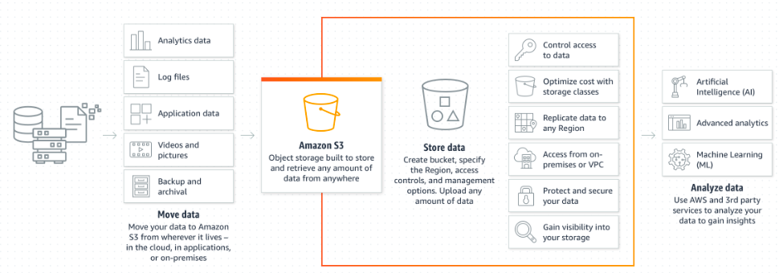

## S3
In AWS there is a service called S3 (Simple Storage Service). It is similar to services like google drive, as it allows users to store and retrieve data. However, AWS has a very high level of security and reliability.

AWS allows you to interact with the S3 buckets on the web, however we can also use AWS CLI (Command-line-interface), or python (Boto3). 

They are stored in availability zones, meaning they have very high availabilty as well. 

## Setting up AWS CLI
- In the terminal, we do the command `pip install awscli`, followed by `aws configure`
- This will then ask you for your key and location. This should not be shared with anybody!
- We can check buckets with `aws s3 ls`
- To make a new bucket, we can do:

`aws s3 mb s3://tech230-jamie-bucket --region eu-west-1`
- To add a file to this, we do:

`aws s3 cp sampletext.txt s3://tech230-jamie-bucket`
- To download the contents of a bucket, we do:

`aws s3 sync s3://tech230-jamie-bucket s3_downloads`
- In order to delete a bucket, it must be empty, so we do this by:

`aws s3 rm s3://tech230-jamie-bucket/sampletext.txt`
- If we want to remove everything, we do:

`aws s3 rm s3://tech230-jamie-bucket --recursive`
- We can then delete the bucket by:

`aws s3 rb s3://tech230-jamie-bucket`

## Automating using python
- In order to use python to automate the process, we need to install boto3 with:

`pip install boto3`
- In order to view the current S3 buckets, we can do:

`import boto3`

`# Connect to s3`

`s3 = boto3.resource("s3")`

`# lists buckets`

`for bucket in s3.buckets.all(): print(bucket.name)`

- If we want to create a bucket, we do:

` import boto3`

`# connect`

`s3 = boto3.client("s3")`

`# Create a bucket on s3`

`bucket_name = s3.create_bucket(Bucket="tech230-jamie-boto", CreateBucketConfiguration={"LocationConstraint":"eu-west-1"})`

`print(bucket_name)`
- We can upload a file to the bucket:

`import boto3`

`# Connect s3 = boto3.resource("s3")`

`# Open the file we want to send, store it in a variable called data`

`data = open("sampletext.txt", "rb")`

`# Specify what bucket we're sending the file to, put_object names file and send its contents`

`s3.Bucket("tech230-jamie-boto").put_object(Key="sampletext.txt", Body=data)`

## We can download from a bucket
`import boto3`

`s3 = boto3.client("s3")`

`# Download from s3 bucket s3.download_file("tech230-jamie-boto", "sampletext.txt", "sampletext1")`
## We delete from a bucket
`import boto3`

`s3 = boto3.resource("s3")`

`# Delete object in bucket`

`s3.Object("tech230-jamie-boto","sampletext.txt").delete()`
## Finally, we can delete a bucket
`import boto3`

`s3 = boto3.resource("s3")`

`# Import the bucket bucket = s3.Bucket("tech230-jamie-boto")`

`# Delete the bucket response = bucket.delete()`

## Using S3 on an EC2 instance
- We first launch an EC2 instance. This has been set up with ubuntu version 20.04
- We do the following commands to install the needed packages.
`sudo apt-get update -y`
`sudo apt-get upgrade -y`
`sudo apt update`
`sudo apt install python3 -y`
`sudo apt install python3-pip -y`
`sudo pip3 install awscli`
- We then need to configure aws using the command:
`aws configure`
- This will ask you for your secure key information. This should NEVER be shared with anyone.
- To interact with S3 using python, we need to install boto3 with the command: `pip install boto3`
## CLI on an EC2 instance
- We create a bucket using the command:
`aws s3 mb s3://tech230-jamie-bucket --region eu-west-1`
- We can check the contents with the command `aws s3 ls`

- We can upload a file to a bucket with the command:
`aws s3 cp ~/textfile.txt s3://tech230-jamie-bucket`
- We are able to download a file as well with the command:
`aws s3 cp s3://tech230-jamie-bucket/textfile.txt S3_downloads`
- To delete a file, we do the command:
`aws s3 rm s3://tech230-jamie-bucket/textfile.txt`
- After the bucket is empty, we can delete it with the command:
`aws s3 rb s3://tech230-jamie-bucket`
- We again can verify this with `aws s3 ls`

## Python
- We need to install the same packages as we did with CLI
- To run python commands we run it in a file.
- We make this file with  `sudo nano tech230_s3_file.py`
- Within this file, we can then add a provision script to run the s3 bucket commands.
- To launch the script, we do the commnd `python3 tech230_s3_file.py`
- Assuming everything is done correctly, nothing should happend as the final step is to delete the bucket. 