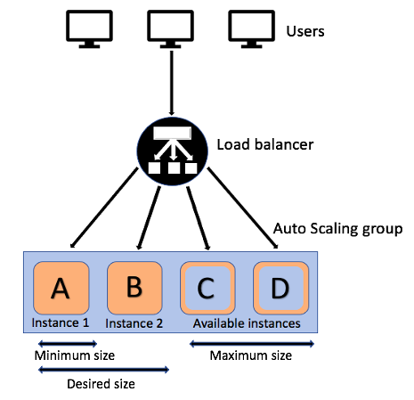
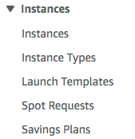
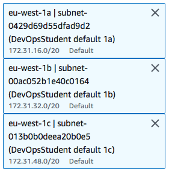
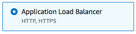
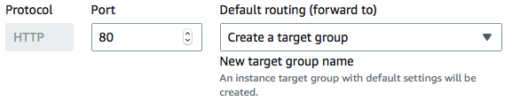
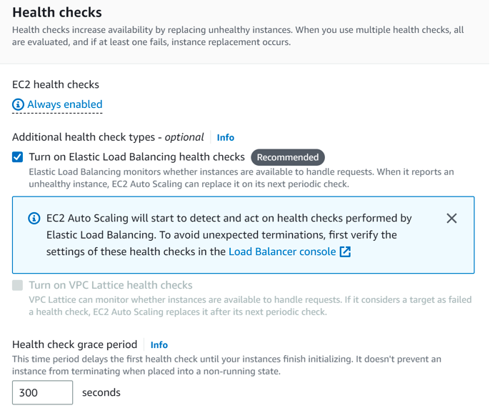
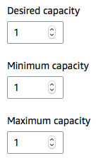
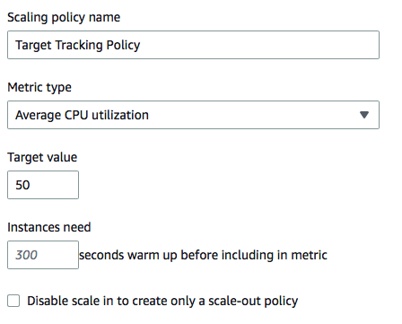
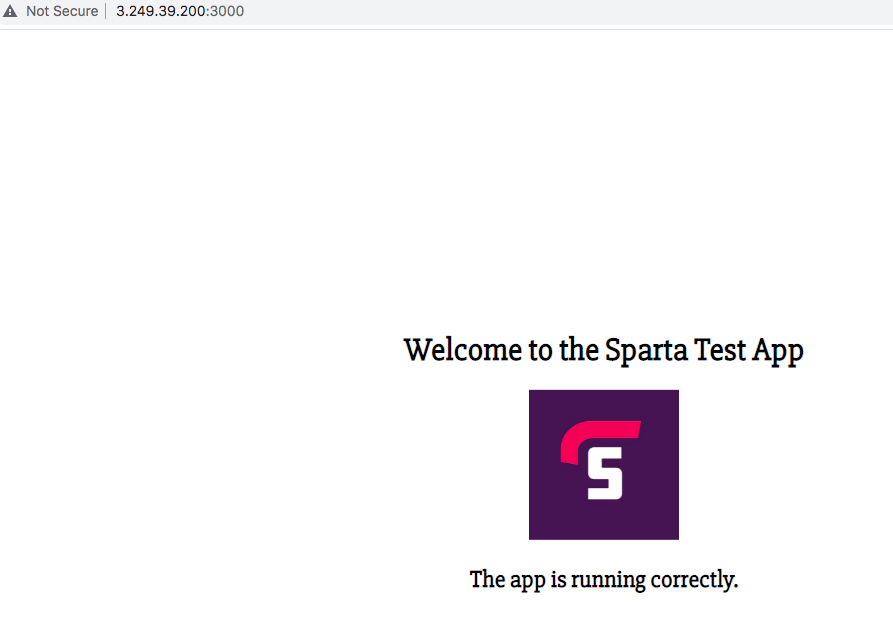

# Auto Scaling and load balancing


## Create an AMI
- To create the load balancer for the app server, we first create an automated app instance.
- We then turn this into an AMI.
- The following can be pasted into the user data to do so:
```
 sudo apt-get update -y
 sudo apt-get upgrade -y

 sudo apt-get install nginx -y

 sudo sed -i "s/try_files \$uri \$uri\/ =404;/proxy_pass http:\/\/localhost:3000\/;/" /etc/nginx/sites-available/default

sudo sed -i "s/# pass PHP scripts to FastCGI server/location \/posts {\n\t\tproxy_pass http:\/\/localhost:3000\/posts;\n\t}/" /etc/nginx/sites-available/default

sudo systemctl restart nginx
sudo systemctl enable nginx

curl -sL https://deb.nodesource.com/setup_12.x | sudo -E bash -

sudo apt-get install nodejs -y
sudo npm install pm2 -g

git clone https://github.com/JamieGodwin/app.git /home/ubuntu/repo

cd /home/ubuntu/repo/app

sudo npm install

node seeds/seed.js

pm2 start app.js --update-env
pm2 restart app.js --update-env
```

## Create the launch template
- We can then click on the "launch template" tab.

- In here we can select the AMI that we have just made.
- We also need to select the instance type as "t2.micro".
- The security settings for HTTP and ssh access can then be added, along with the access key.
## Auto-scaling
- We first go to "Auto Scaling Groups" and select "Create an Auto Scaling Group". 
### Page 1 
- We are then able to select the launch template that we want to use.
### Page 2
- On the VPC availabilty zones we select: 


### Page 3
- We then need to select "Attach to a new load balancer"
- We then select: 


- We then select "Internet-facing"
- After, we then select "Create new target group". Then we rename it.

- We then enable health checks.

### Page 4
- We can then choose our capacities.


- We then select "Target Tracking policy"

### Page 5
- We can then select our key and value.
- Here the key = "Name" and value = "tech230-jamie-nginx-HA-SC"
- This should then be ready to launch. 

## Load balancer
- We can then access the page by going to theload balancer tab. 
- There's a DNS name that will give us an ip address.

