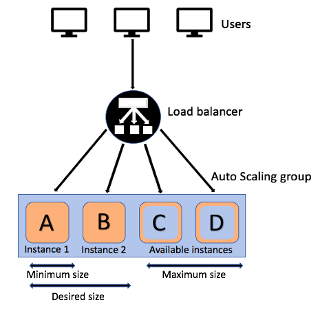
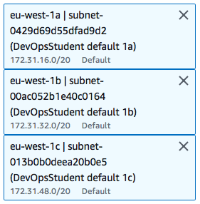
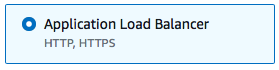
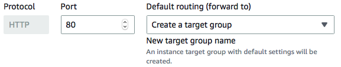
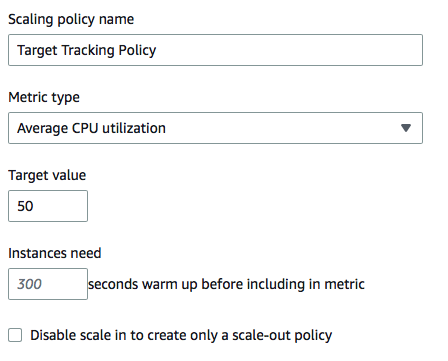

## Create an AMI
- To create the load balancer for the nginx server, we first create an automated nginx instance.
- We then turn this into an AMI.
- The following can be pasted into the user data to do so:
`#!/bin/bash`

 `# Update and upgrade nginx`
 `sudo apt-get update -y`
 `sudo apt-get upgrade -y`

` # Install the web server nginx`
 `sudo apt-get install nginx -y`
 
`sudo systemctl restart nginx`
`sudo systemctl enable nginx`

## Create launch template
- We can then click on the "launch template" tab.
- In here we can select the AMI that we have just made.
- We also need to select the instance type as "t2.micro".
- It is then best practice to put the above code into the user data again. 
## Auto-scaling
- We first go to "Auto Scaling Groups" and select "Create an Auto Scaling Group". 
### Page 1 
- We are then able to select the launch template that we want to use.
### Page 2
- On the VPC availabilty zones we select: 

### Page 3
- We then need to select "Attach to a new load balancer"
- We then select: 

- We then select "Internet-facing"
- After, we then select "Create new target group". Then we rename it.

- We then enable health checks.
### Page 4
- We can then choose our capacities.

- We then select "Target Tracking policy"

### Page 5
- We can then select our key and value.
- Here the key = "Name" and value = "tech230-jamie-nginx-HA-SC"
- This should then be ready to launch. 