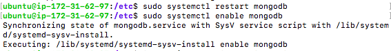
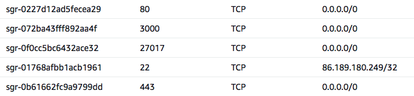
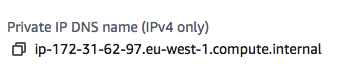
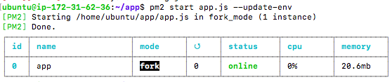

- Make sure mongodb is running, and the app folder is synced over to the app instance.

## Working in mongodb terminal
- Do the command: ` cd /etc `
- Do: ` sudo nano mongodb.conf `
- This will take you to a folder
- In the folder, find the part that says "bind_ip" and change the value to 0.0.0.0
- We now need to restart the mongodb server.
- We do: ` sudo systemctl restart mongodb `
- We then need to enable it: ` sudo systemctl enable mongodb `

## Working in AWS
- In the DB instance, we go to security
- For the inbound rules, we need a TCP rule with port range 27017 and source 0.0.0.0

## Working in app terminal
- After we have cd into the app, we need to install node.js with ` sudo apt-get install nodejs -y `
- We the do: ` export DB_HOST=mongodb://172.31.62.97:27017/posts `. This needs to be done with your private mongodb ip. 

- We can check this has been added by doing `printenv`
- We then need to cd into the app, and install npm.
- We do `curl -sL https://deb.nodesource.com/setup_6.x | sudo -E bash -`
- Then ` sudo apt install npm `
- We then do: `sudo npm install -g pm2` to get pm2
- Note: If we needed to change the DB_HOST, we could do `sudo nano .bashrc
- We then cd into the app
- We then need to do ` npm install `
- Then: `pm2 start`
- Then finally: ` pm2 start app.js --update-env `

### Note: When we search for the posts page, the public ip will change each time.

## How to save AMI
- We save in the same way as we did the template.
- However, we instead create an image instead of an image template. 