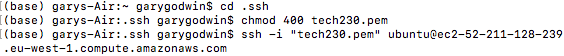
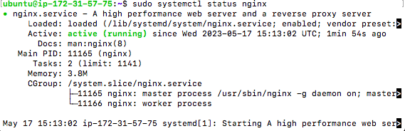
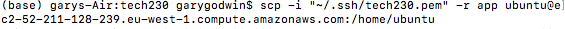
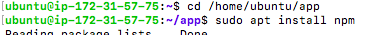
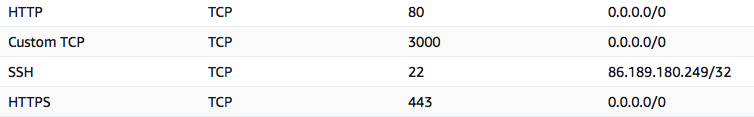

## Ubuntu terminal
- Make sure we have loaded into the nginx instance.
- In terminal:

- The third command will vary.
- To make sure it's running: 

## Using the app folder
- Make sure you know where the app folder is.
I have it placed in documents/tech230.
- We then cd into the app folder.
- We then do the following command:

- We need to make sure the ip address in here is chnaged to the one we have in our instance.
- We return to the unbuntu terminal once this is downloaded.

## Back in ubuntu terminal
- We can now do the standard app setup
- We do: ` sudo apt-get install nodejs -y `
- Then: ` curl -sL https://deb.nodesource.com/setup_6.x | sudo -E bash - `
- We then need to cd into the app to start it.

- Note: we need ubuntu rather than vagrant here.
- We can then do ` npm start `

## Instance security
- In instance, we need to change inbound security files. 

- The custom TCP needed the port number changed to 3000.
- The ssh needed the source changed to my ip, so only I can ssh into the app. 