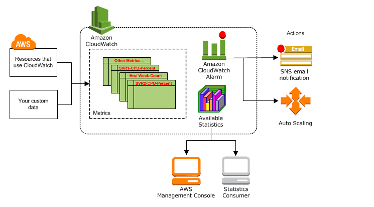

Amazon Cloud watch is a repository for metrics, which lets users see key stats based on metrics chosen by the customer.
## 1. Instance
- In order to set up a dashboard, we must first create an instance.
- Ideally, we have something running in the instance to increase the CPU usage.
## 2. Create the dashboard
- After creating the instance, we find the tab that says `monitoring`, and within this there is an option to go to `Add to dashboard`.

- When we click on this, we are able to create a dashboard.
## 3. Create alarm
- We can now navigate to the side bar and select `All Alarms`
- We can then slect `EC2` and `Per-Instance Metrics`
- We can then selct `CPUUtilization`
- We can then select under conditions: `Static`, `Greater` and then the percentage we want to monitor.
- We can then create a new `topic` with our email address.

- Then we just need to add our alarm name.